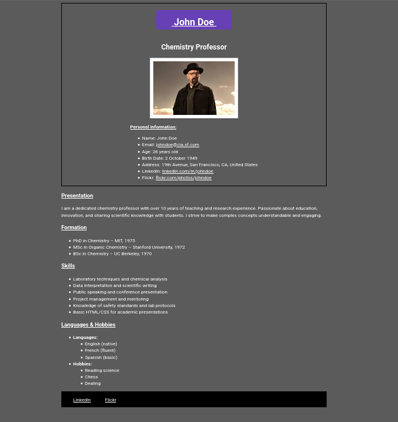

##  Technologies utilisées

- HTML5
- CSS3 (Flexbox, transitions)
- [Google Fonts – Roboto](https://fonts.google.com/specimen/Roboto)
- [Schema.org – Microdonnées `Person`](https://schema.org/Person)

##  Lien de déploiement

<https://baldwin-sudo.github.io/tp1-html-ubo/>

##  Aperçu

